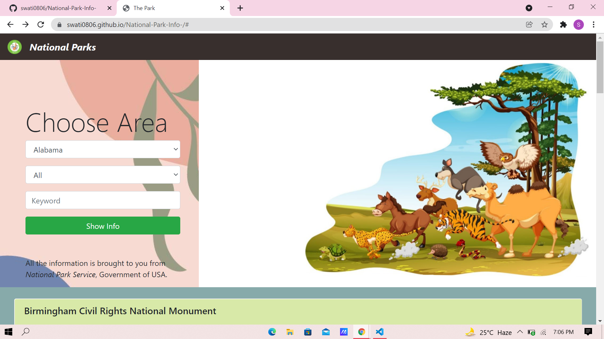
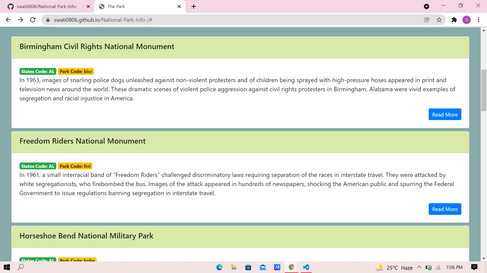
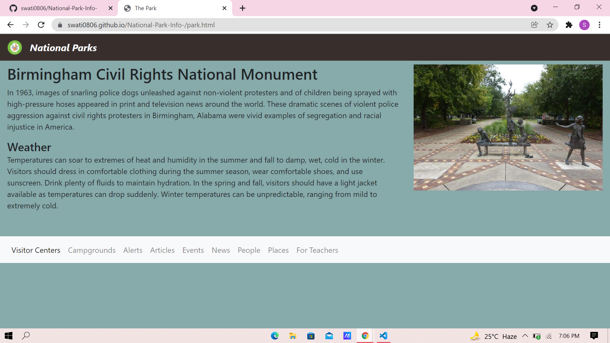
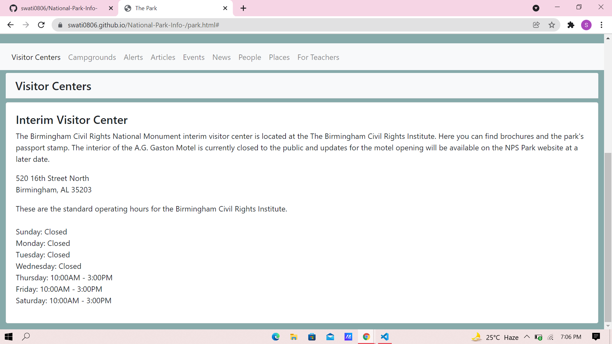
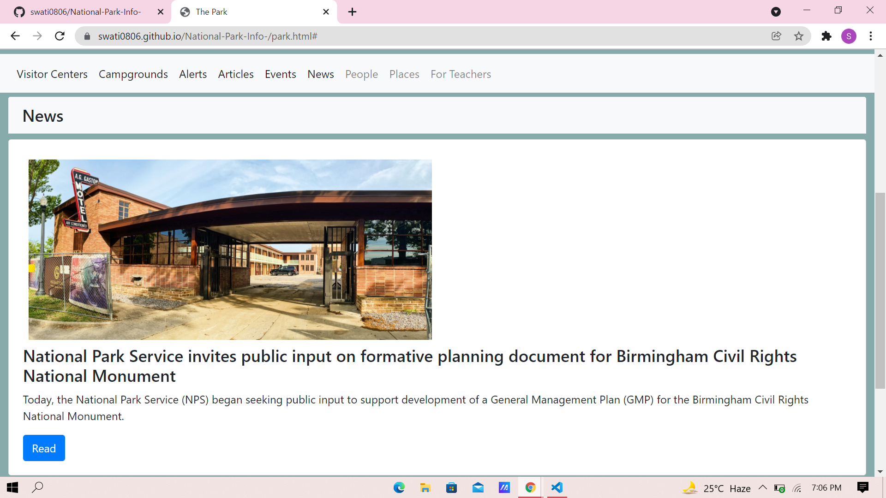

# National Park Info

This web application serves as a virtual information for the National Park Service. Detailed below is information on the technologies used and the features in the app.

## Tech Stack

**[Bootstrap](https://getbootstrap.com/), HTML, CSS, Javascript**

**API Used:** [National Park API](https://www.nps.gov/subjects/developer/api-documentation.htm#/)

## Authors

- [@swatinamdev](https://github.com/swati0806)

**Repository Link:** 

https://github.com/swati0806/National-Park-Info-

**Website Deployed at:**

Github pages : https://swati0806.github.io/National-Park-Info-/#

- [National Park API](https://www.nps.gov/subjects/developer/api-documentation.htm#/) to present national park information.
## Screenshots

**FRONT PAGE**

  

**PARKS LIST PAGE**

  

**PARK INFO PAGE**

  

**VISITOR CENTRE SECTION**

  

**NEWS SECTION**

  
## Features Implemented

 **Filter**
- State
 
 **Search**
- Name
- Keyword
 
 **List Details**
- Alerts
- Articles
- News Releases
- Events
- Places
- Visitor centers
- Campgrounds

